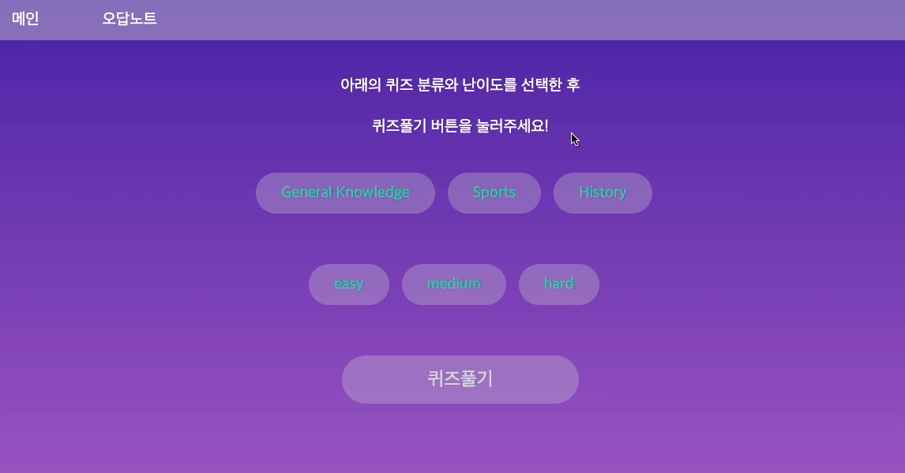
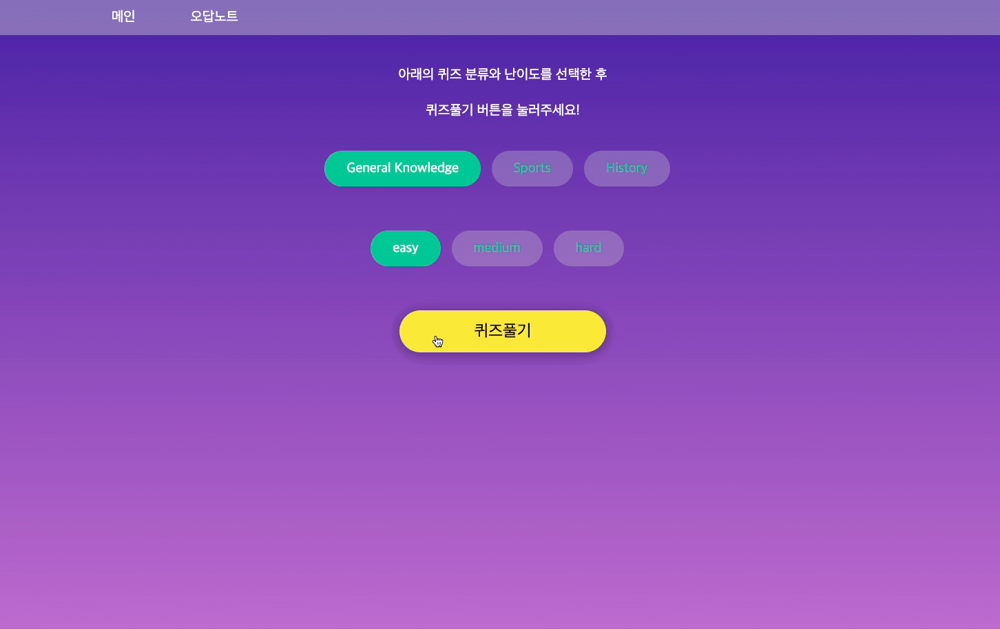

# Let's Quiz

[결과물을 실행해 볼수 있는 URL](https://classting-assignment-delta.vercel.app/)

---

## 프로젝트 설명
다양한 영어 퀴즈를 풀어보고 오답노트까지 확인할 수 있는 웹앱 입니다.

---

## 프로젝트 실행 방법

1. git clone

```bash
git clone https://github.com/KKingmo/Lets-quiz.git
```

2. install

```bash
yarn install
```

3. build

```bash
yarn build
```

4. start

```bash
yarn start
```

5. test

```bash
yarn test
```

---

## 기술스택 및 라이브러리

- React.js
- Next.js
- TypeScript
- Recoil
- Emotion
- Victory
- axios
- cypress
- Vercel

---

## 폴더 구조

```bash
.
├── 📂cypress
│   └── 📂e2e
│       └── 📜spec.cy.ts  // 테스트 코드
├── 📂pages
│   ├── 📂note            // 오답 노트 페이지
│   ├── 📂quiz            // 퀴즈 풀기 페이지
│   └── 📂result          // 퀴즈 결과 페이지
├── 📂src
│   ├── 📂commons
│   │   ├── 📂buttons     // 버튼 공통 컴포넌트
│   │   ├── 📂formRadio   // 라디오 공통 컴포넌트
│   │   ├── 📂hooks       // 커스텀 훅
│   │   ├── 📂layout      // 레이아웃 UI
│   │   ├── 📂libraries   // 유틸 함수들
│   │   ├── 📂quizOption  // 퀴즈 카테고리, 난이도 데이터
│   │   └── 📂store       // recoil state 함수
│   └── 📂units
│       ├── 📂QuizHeader  // 퀴즈 풀기 페이지 헤더 컴포넌트
│       ├── 📂QuizNote    // 오답 노트 컴포넌트
│       ├── 📂QuizOption  // 퀴즈 카테고리, 난이도 설정 컴포넌트
│       ├── 📂QuizResult  // 퀴즈 결과 페이지 컴포넌트
│       ├── 📂QuizStart   // 퀴즈 풀기 페이지 퀴즈 컴포넌트
│       └── 📂QuizTimer   // 퀴즈 타이머 컴포넌트
└── 📂styles
        ├── 📜globalStyles.ts  // 전역 스타일
        └── 📜media.ts    // 미디어 쿼리 tablet, mobile size 데이터
```

---

## 기능 시연 및 설명

- index 페이지
  - 퀴즈의 카테고리와 난이도를 설정한 후 퀴즈 풀기 버튼을 눌러 퀴즈를 시작합니다.  
  
  

- 퀴즈 풀기 페이지, 퀴즈 결과 페이지
  - 사용자는 문항에 대한 답안을 4개 보기 중에 선택할 수 있습니다.
  - 답안을 선택하면 답안이 맞았는지 틀렸는지 바로 알수있고, 다음 문제로 넘어갈 수 있습니다.
  - 모든 문항을 다 풀면 사용자는 소요시간, 정답 개수, 오답 개수를 알 수 있습니다.  
  
  

- 오답노트 페이지
  - 사용자는 완료한 퀴즈에 대한 오답노트를 제공받습니다.  
  
  
